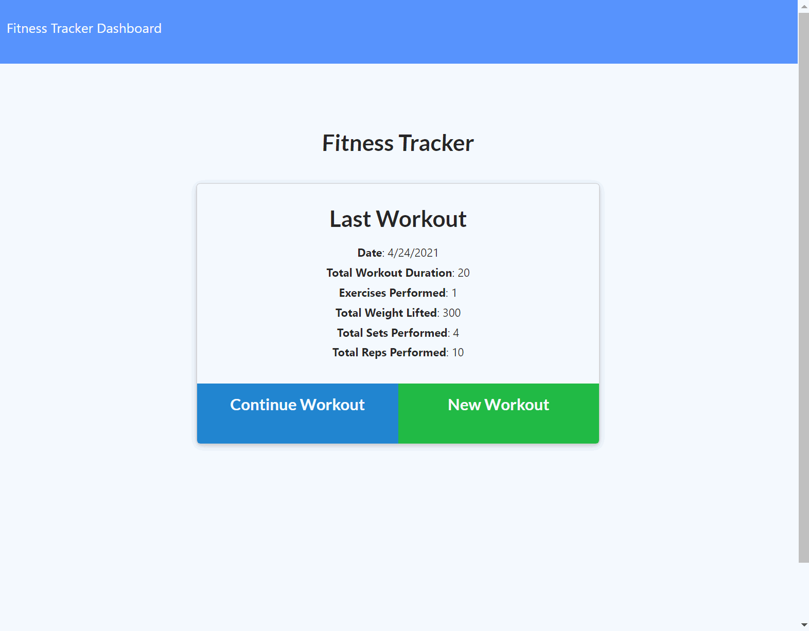

# Workout_Tracker - [workout-records](https://workout-records.herokuapp.com/)

## Table of contents
- [Description](#Description)
- [User Story](#User/Story)
- [Usage](#Usage)
- [Framework HTML/JS](#Framework)
- [Credits](#Credits)

## Illustration



## Description

A workout tracker app that keeps record of exercises you've made using MongoDB as datastorage
   
## User/Story  
```md
An app to view, create and track daily workouts.You're able to log multiple exercises in a workout on a given day. You should also be able to track the name, type, weight, sets, reps, and duration of the exercise. If the exercise is a cardio exercise, You should be able to track the distance traveled.
```

## Usage

* Visit [workout-records](https://workout-records.herokuapp.com/?id=608766423fa3570015585e4e)

* Base options
  * Start a New Workout

  * Either add an exercise or complete workout...

  * Top left corner: Dashboard you can view your records of workout for 7 days

## Framework

#### JavaScript(back-end) and public Html/CSS

  * MongoDB used to store data
    * mongoose model
        ```
            const Schema = mongoose.Schema;
            const workoutSchema = new Schema({
                day: {
                    ...
                },
                exercises: [
                    {
                        ...
                    }
                ]
            })

            const Workout = mongoose.model('Workout', workoutSchema);
        ```
    * db operators
        * The following aggregation operation:
            * adds a new field totalDuration in the output
            (adding all: exercises.duration).
            * of negative one (e.g. -1, as below) to sort 
            in descending order or a positive value (e.g. 1)
            to sort in ascending order.
            * limit to 1 in order to get the last one since is 
            sorted in descending order
        ```
        const lastWorkout = await Workout.aggregate([
            { $sort: { _id: -1 } },
            { $limit: 1 },
            {
                $addFields: {
                    totalDuration: { $sum: '$exercises.duration' }
                }
            }
        ])
        ```
        * The following aggregation operation:
            * notice this part:
                .sort({ _id: -1 })
                .limit(7)
                           - gets last 7 records...

                .sort({ day: 'asc' }); - the new list(7) order
                                        from oldest to newest 

        ```
         const workouts = await Workout.aggregate([
            {
                $addFields: {
                    totalDuration: { $sum: '$exercises.duration' },
                    totalWeight: { $sum: '$exercises.weight' }
                }
            }
        ])
            .sort({ _id: -1 })
            .limit(7)
            .sort({ day: 'asc' });
        ```

  * Express web framework to run the app
    
## Credits
 * - [mongoDB-docs](https://docs.mongodb.com/manual/reference/operator/aggregation/addFields/)
 * - [Heroku-devcenter](https://devcenter.heroku.com/) - for deployment


## Directory
* [GitHub Source](https://github.com/VictorCodrean/Workout_Tracker)

## App link
Victor Codrean    
*  [workout-records/app link:](https://workout-records.herokuapp.com/)


Asking me any questions:

<a href="mailto:codreanvictor@gmail.com" style="text-decoration:none"></a>

[](https://github.com/VictorCodrean)

